# Introduction

The `tidyverse` has quickly developed over the last years.
Its first implementation as a collection of partly older packages was in the second half of 2016.
All its packages "share an underlying design philosophy, grammar, and data structures."^[citation from [tidyverse homepage](https://www.tidyverse.org/)]
It is for sure difficult to tell, if "learning the `tidyverse`" is a hard task, since the result of this assessment might differ from person to person.
We do believe though, that there are concepts in its approach, which -- when grasped -- have the potential to increase one's productivity, since code creation will seem more natural.
While this might be true for all languages (once you speak it well enough, things go smoothly), in our opinion the `tidyverse` worth exploring in depth, since it is

1. consistent: an especially well designed framework that aims at making data analysis and programming intuitive,
2. evolving: constantly deepened understanding for challenges arising in modern data analysis leads to improving ergonomic user interfaces.

## Speakers

**Kirill Müller** (\@krlmlr)


**Patrick Schratz** (\@pat-s)


- M.Sc. Geoinformatics
- Researcher/Research Engineer at University of **Jena** and **LMU Munich**
- PhD Candidate

---

- Unix & R enthusiast
- Author/Contributor/Maintainer of several R packages: 
  - ([mlr3](https://github.com/mlr-org/mlr3), [mlr](https://github.com/mlr-org/mlr))
  - sperrorest
  - oddsratio
  - xaringan
  - circle
  - RQGIS
  - travis
  - tic
  - ...

## Overview

This course covers several topics, which everyone working more intently with the `tidyverse` almost inevitably needs to deal with at some point or another.
The topics are organized in chapters that contain mostly R code with output and text.
In each section, exercises are provided.

## R as a toolkit


- Scriptability $\rightarrow$ R
- Literate programming (code, narrative, output in one place) $\rightarrow$ R Markdown
- Version control $\rightarrow$ Git / GitHub

### Why R and RStudio?

```{R indeeddotcom, echo = F, fig.height = 4, fig.width = 6}
# The popularity data
pop_df <-
  data.frame(
    lang = c("SQL", "Python", "R", "SAS", "Matlab", "SPSS", "Stata"),
    n_jobs = c(107130, 66976, 48772, 25644, 11464, 3717, 1624),
    free = c(T, T, T, F, F, F, F)
  )
## Plot it
pop_df %>%
  mutate(lang = lang %>% factor(ordered = T)) %>%
  ggplot(aes(x = lang, y = n_jobs, fill = free)) +
  geom_col() +
  geom_hline(yintercept = 0) +
  aes(x = reorder(lang, -n_jobs), fill = reorder(free, -free)) +
  xlab("Statistical language") +
  scale_y_continuous(labels = scales::comma) +
  ylab("Number of jobs") +
  labs(
    title = "Comparing statistical languages",
    subtitle = "Number of job postings on Indeed.com, 2019/01/06"
  ) +
  scale_fill_manual(
    "Free?",
    labels = c("True", "False"),
    values = c("#f92672", "darkslategray")
  ) +
  ggthemes::theme_pander(base_size = 17) +
  theme(legend.position = "bottom")
```

### Some R basics

* You will load packages at the **start of every new R session**.
  - "Base" R comes with tons of useful built-in functions. It also provides all the tools necessary for you to write your own functions.
  - However, many of R's best data science functions and tools come from external packages written by other users.

* R easily and infinitely parallelizes. For free.
  - Compare the cost of a [Stata/MP](https://www.stata.com/statamp/) license, nevermind the fact that you effectively pay per core...

## R code examples

### Linear regression

```{r 00-Introduction-4}
fit = lm(dist ~ 1 + speed, data = cars)
summary(fit)
```

### Base R plot

```{r cars_basefig}
par(mar = c(4, 4, 1, .1)) ## nice plot margins
plot(cars, pch = 19, col = 'darkgray')
abline(fit, lwd = 2)
```

### ggplot2

```{r gapm_plot}
library(ggplot2)
library(gapminder) ## For the gapminder data

ggplot(data = gapminder,
       mapping = aes(x = gdpPercap, y = lifeExp)) +
  geom_point()
```

### gganimate


## R vs. RStudio

- R is a statistical **programming language**
- RStudio is a convenient interface for R (an **integrated development environment**, IDE)
- At its simplest:
    - R is like a car’s engine
    - RStudio is like a car’s dashboard


## R vs. R packages

- R packages **extend** the functionality of R by providing additional functions, data, and documentation.

- They are written by a world-wide community of R users and can be downloaded for no cost


## R packages

- **CRAN**: A group of people who check that packages fulfill certain standards

- **Mirror**: A location on the web where to download R packages from. Because many thousand people download them daily, the load is distributed on different machines. Pick one which is geographically close to you

- **R base/recommended packages**: The base installation of R ships with a bunch of default packages. In addition, there are some more packages listed as "recommended".


"base" packages are managed by the R core team and will only be updated for every R release.

Packages listed as "recommended" inherit the attributes of being widely used and having a long history in the R community.

```{r 00-Introduction-7, echo = FALSE}
x <- installed.packages()
as.data.frame(x[ !is.na(x[ ,"Priority"]), c("Package", "Priority")][1:20, ]) %>%
  dplyr::filter(Priority == "base") %>%
  dplyr::mutate(Package = as.character(Package))
```

```{r 00-Introduction-8, echo = FALSE}
as.data.frame(x[ !is.na(x[ ,"Priority"]), c("Package", "Priority")][1:20, ]) %>%
  dplyr::filter(Priority == "recommended")
```

## .Rprofile

- File in your home directory `~/.Rprofile`

- Will be executed before every R session starts

- Useful to set global options and for loading of often used packages

## .Renviron

- File in your home directory `~/.Renviron`

- Used to set environment variables

- Used to store "Access tokens" (Github, CI provider, C++ flags)

## RStudio

$\rightarrow$ Exists to **boost** your productivity

$\rightarrow$ Change the defaults to your liking so you _actually_ can be **productive**

$\rightarrow$ Keybindings = productivity

Since RStudio v1.3 a [portable JSON settings file](https://docs.rstudio.com/ide/desktop-pro/latest/settings.html#preferences) exists.

If you want to have sane settings without much hassle, you can execute the following R code: `source("https://bit.ly/rstudio-pat")`

This code will change/overwrite your existing RStudio settings and

- set custom keybindings

- move the console panel to the top-right (by default bottom-left)

- Enable/Disable some core settings to have a better overall experience

---

R scripts (source code) are written in the _Source_ pane (Editor).

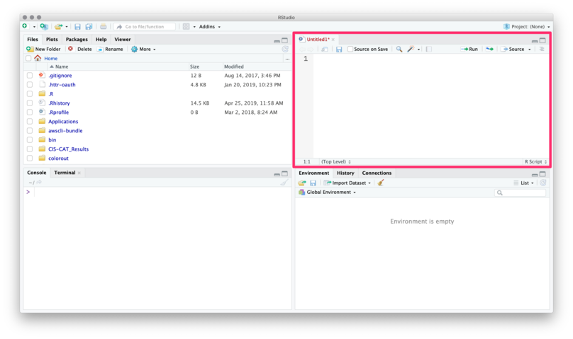

(Source of all following RStudio screenshots: https://github.com/edrubin/EC525S19)

---

You can use the menubar or ⇧+⌘+N / ⇧+CTRL+N to create new R scripts.

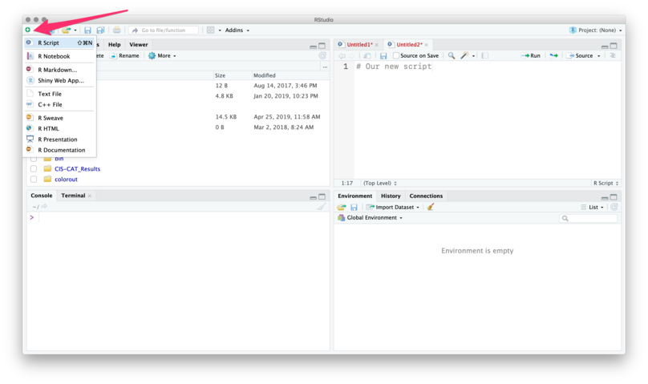

---

To execute commands from your R script, use ⌘+Enter / CTRL+Enter.

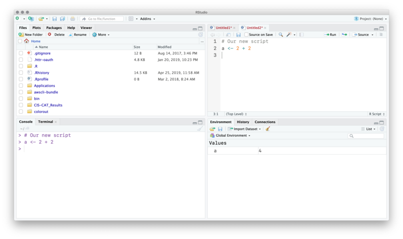

RStudio will execute the command in the console.

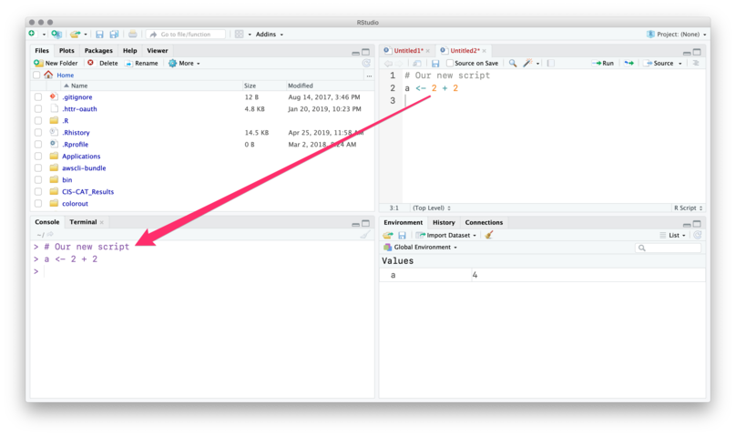

You can see the new object in the _Environment_ pane.

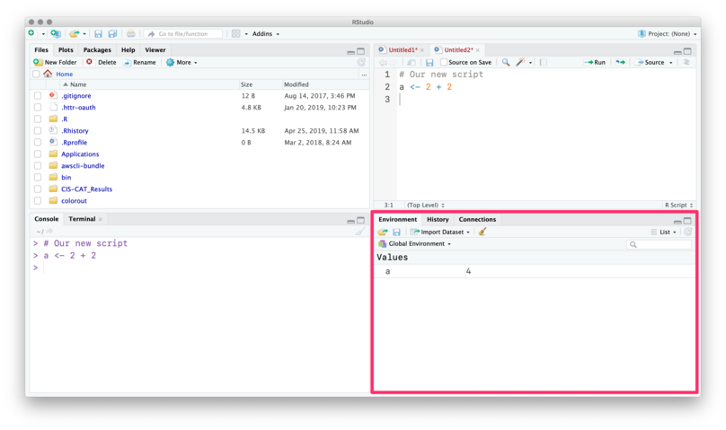

---

The _History_ tab records your old commands.

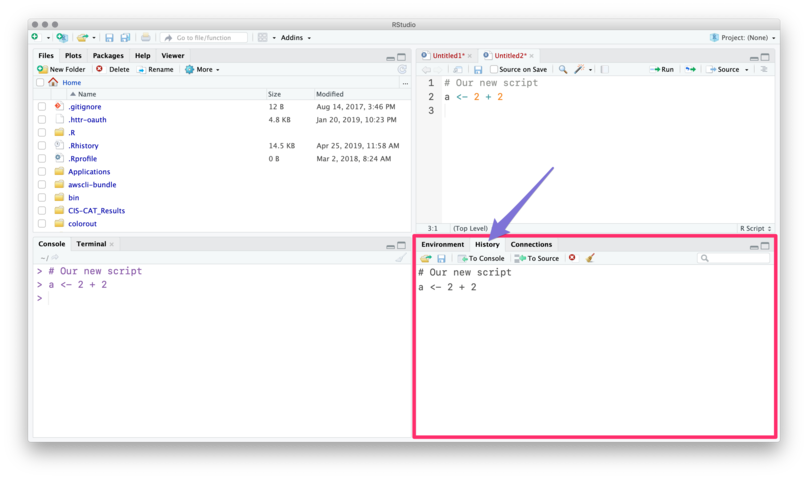

---

The _Files_ pane is the file explorer.

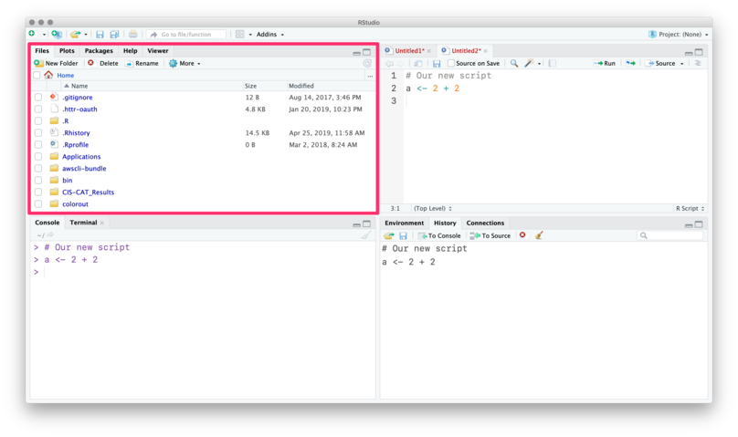

---

The _Plots_ pane/tab shows... plots.

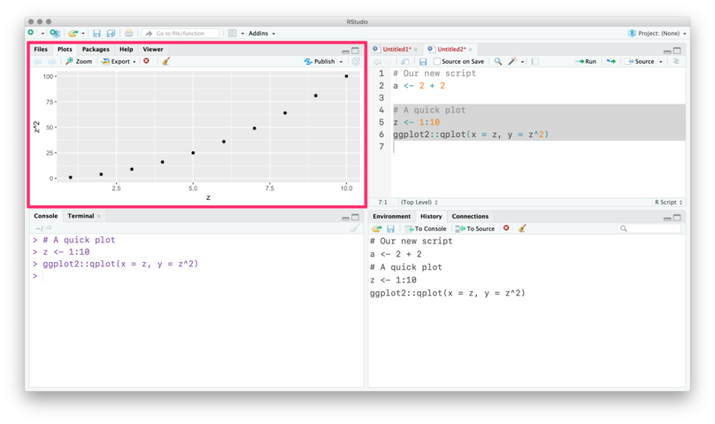

---

_Packages_ shows installed packages

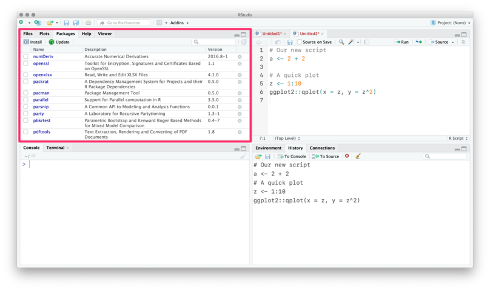

---

_Packages_ shows installed packages and whether they are _loaded_.

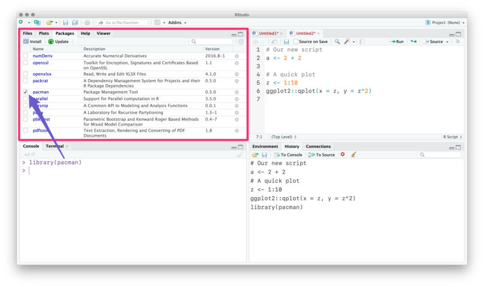

---

The _Help_ tab shows help documentation (also accessible via `?`).

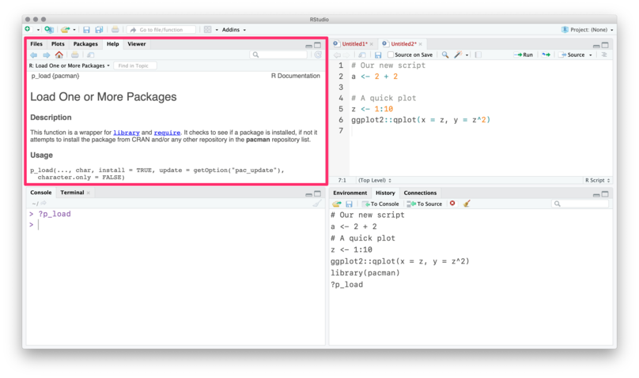

---

Finally, you can customize the actual layout

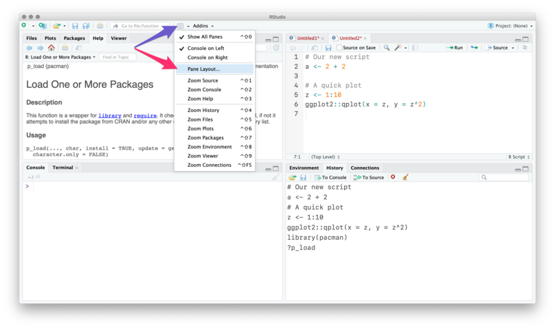

## RStudio Addins

RStudio can be further enhanced by so called "addins".
These are clickable snippets that execute certain actions in RStudio.

They aim to make repetitive tasks easier and to save you time.
There is an addin called [addinslist](https://github.com/daattali/addinslist) which lists all available addins. 
It can be installed as a normal package from CRAN:

`install.packages("addinslist")`

To have an addin available in RStudio after installation, RStudio needs to be restarted.

## RStudio projects

Without a project, you will need to define **long** file paths which **only exist on your machine**.

```r
sample_df <- read.csv("/Users/<yourname>/somewhere/on/this/machine/sample.csv")
```

With a project, R automatically references the project's folder as the current working directory.

From there on, you can use _relative paths_ to point to files.

```r
sample_df <- read.csv("sample.csv")
```

**Double-plus bonus**: The [_here_](https://github.com/r-lib/here) package extends _RStudio project_ philosophy even more and helps in cases when not using RStudio (e.g. on the command line).

## Alternatives to RStudio

- Using R directly in the terminal via [radian](https://github.com/randy3k/radian) (optimized R console interpreter)

- R is supported in other "general purpose IDE's" (VScode, Sublime Text, Atom, Vim, etc.)

```{r 00-Introduction-21, child = here("script", "0.Rmd"), eval = TRUE}
```
