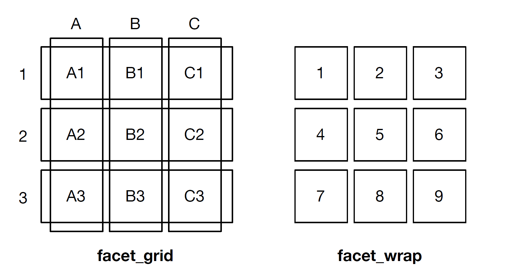

# {ggplot2} advanced {#vis-adv}

## Facetting

<details><summary>*Click here to show setup code.*</summary>
```{r setup-vis-adv}
library(tidyverse)
library(ggsci)
library(ggpubr)
library(patchwork)
```
</details>

<br>

"Facetting" (or trellis plots, lattice plots) denotes an idea of dividing a graphic into sub-graphics based on the (categorical) values of one or more variables of a dataset.

```{r, eval=FALSE}
facet_grid(facets = . ~ ., scales = "fixed", ...)
facet_wrap(facets = <variable> ~ ., scales = "fixed", ...)
```

**facet**: Formula with splitting variable.

**scales**: Scale of the axes over the sub-graphics.

The position of `<variable>` denotes on which axis the facets will be shown:

- `<variable> ~ .` $\right_arrow$ y-axis

- `. ~ <variable>` $\right_arrow$ x-axis



### `facet_wrap()`

```{r, fig.width=8, fig.height=4}
facet_x = ggplot(mpg, aes(displ, hwy)) +
  geom_point(aes(colour = fl)) +
  scale_color_nejm() +
  facet_grid(. ~ year) +
  theme_pubr()

facet_y = ggplot(mpg, aes(displ, hwy)) +
  geom_point(aes(colour = fl)) +
  scale_color_nejm() +
  facet_grid(year ~ .) +
  theme_pubr()
```

```{r}
facet_x + facet_y
```

Facets can also be shown on both axes using different (categorical) variables

```{r, fig.width=8, fig.height=4}
ggplot(mpg, aes(displ, hwy)) +
  geom_point(aes(colour = class)) +
  facet_grid(year ~ cyl) +
  theme_pubr()
```

Rather than visualizing a 2D-facet plot on x and y, there is also the option to combine both in one axis.
(For this to work, the variables need to be of class `factor`).

```{r}
mpg$manufacturer = as.factor(mpg$manufacturer)
mpg$year = as.factor(mpg$year)
```

```{r, fig.width=8, fig.height=5}
ggplot(mpg, aes(displ, hwy)) +
  geom_point() +
  facet_wrap(~ manufacturer:year) +
  theme_pubr()
```

This is usually a better setting than doubling the facet labels - but might also be up to personal preference.

```{r, fig.height=8}
ggplot(mpg, aes(displ, hwy)) +
  geom_point() +
  facet_wrap(manufacturer ~ year) +
  theme_pubr()
```

### `facet_grid()`

While `facet_wrap()` tries to act smart and share axes of sub-plots, `facet_grid()` will create a grid of sub-plots each having their own axes.
Most of the time when using only one categorical variable, `facet_wrap()` does a good job and is preferred over `facet_wrap()`.

However, `facet_grid` might be preferred in the following cases:

- when facetting over >= 2 variables

- when plots of empty combinations should be shown

Let's compare how `facet_grid` and `facet_wrap` differ for 2 grouping variables

```{r, fig.height=10}
fc_gd = ggplot(mpg, aes(displ, hwy)) +
  geom_point(aes(colour = class)) +
  facet_grid(year ~ cyl) +
  theme_pubr()

fc_wrap = ggplot(mpg, aes(displ, hwy)) +
  geom_point(aes(colour = class)) +
  facet_wrap(year ~ cyl) +
  theme_pubr()

fc_gd / fc_wrap
```

### Scales

By default, scales are fixed across each facet (`scales = "fixed"`).
This means that all sub-plots should share the same axes.
By setting this argument to either `"free_x"` or `"free_y"` one can specify that each each sub-plot should have its own scale.

```{r, fig.width=8, fig.height=3.5}
ggplot(mpg, aes(displ, hwy)) +
  geom_point() +
  facet_grid(year ~ cyl, scales = "free_x") +
  theme_pubr(base_size = 7)
```

This only makes sense if the ranges for each facet differ substantially (so not in this example!).
This example is good to show the confusion that this setting might introduce.
People usually expect to look at **equal ranges** across facets (unless there is a good reason for it not to) and differing scales make the plot more complicated.

Keep in mind: Visualization should _simplify_ data!

### Renaming of facet labels

A non-trivial change that is often applied to facet plots is the renaming of the facet labels.
Facet labels are automatically created based on the factor levels of the respective variable.

There are two ways to change the labels:

- By modifying the underlying factor levels of the data

- By providing a custom "labeller" function

```{r}
my_labeller = as_labeller(c(`4` = "Cyl: 4", `5` = "Cyl: 5",
  `6` = "Cyl: 6", `8` = "Cyl: 8"))
```

```{r, fig.width=8, fig.height=4}
ggplot(mpg, aes(displ, hwy)) +
  geom_point() +
  facet_grid(. ~ cyl, labeller = my_labeller) +
  theme_pubr()
```
