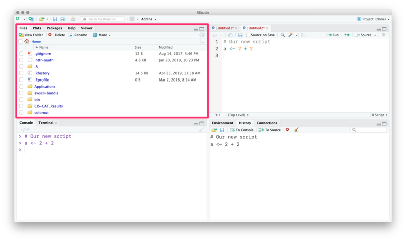

# RStudio

## IDE structure

$\rightarrow$ Exists to **boost** your productivity

$\rightarrow$ Change the defaults to your liking so you _actually_ can be **productive**

$\rightarrow$ Keybindings = productivity

Since RStudio v1.3 a [portable JSON settings file](https://docs.rstudio.com/ide/desktop-pro/latest/settings.html#preferences) exists.

If you want to have sane settings without much hassle, you can execute the following R code: `source("https://bit.ly/rstudio-pat")`

This code will change/overwrite your existing RStudio settings and

- set custom keybindings

- move the console panel to the top-right (by default bottom-left)

- Enable/Disable some core settings to have a better overall experience

---

R scripts (source code) are written in the _Source_ pane (Editor).


(Source of all following RStudio screenshots: https://github.com/edrubin/EC525S19)

---

You can use the menubar or ⇧+⌘+N / ⇧+CTRL+N to create new R scripts.


---

To execute commands from your R script, use ⌘+Enter / CTRL+Enter.


RStudio will execute the command in the console.


You can see the new object in the _Environment_ pane.


---

The _History_ tab records your old commands.


---

The _Files_ pane is the file explorer.



---

The _Plots_ pane/tab shows... plots.


---

_Packages_ shows installed packages


---

_Packages_ shows installed packages and whether they are _loaded_.


---

The _Help_ tab shows help documentation (also accessible via `?`).


---

Finally, you can customize the actual layout


## RStudio Addins

RStudio can be further enhanced by so called "addins".
These are clickable snippets that execute certain actions in RStudio.

They aim to make repetitive tasks easier and to save you time.
There is an addin called [addinslist](https://github.com/daattali/addinslist) which lists all available addins. 
It can be installed as a normal package from CRAN:

`install.packages("addinslist")`

To have an addin available in RStudio after installation, RStudio needs to be restarted.

## RStudio projects

Without a project, you will need to define **long** file paths which **only exist on your machine**.

```r
sample_df <- read.csv("/Users/<yourname>/somewhere/on/this/machine/sample.csv")
```

With a project, R automatically references the project's folder as the current working directory.

From there on, you can use _relative paths_ to point to files.

```r
sample_df <- read.csv("sample.csv")
```

**Double-plus bonus**: The [_here_](https://github.com/r-lib/here) package extends _RStudio project_ philosophy even more and helps in cases when not using RStudio (e.g. on the command line).

## Alternatives to RStudio

- Using R directly in the terminal via [radian](https://github.com/randy3k/radian) (optimized R console interpreter)

- R is supported in other "general purpose IDE's" (VScode, Sublime Text, Atom, Vim, etc.)

```{r 00-Introduction-21, child = here("script", "0.Rmd"), eval = TRUE}

```

