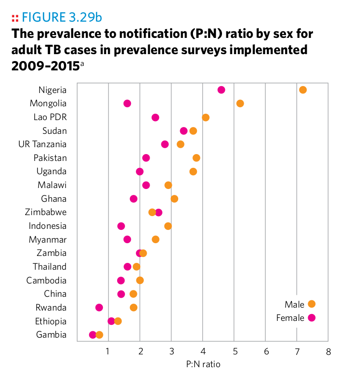
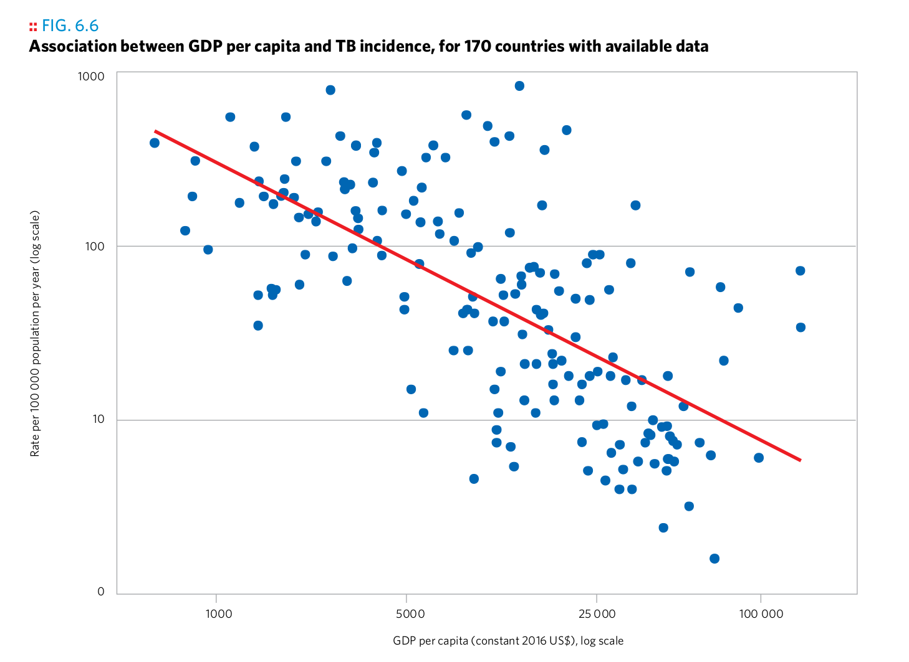
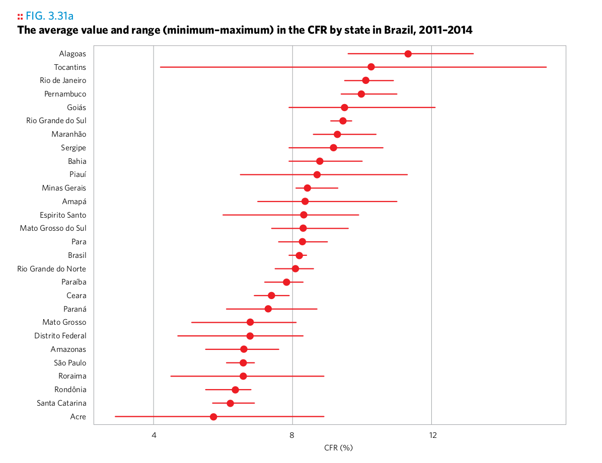
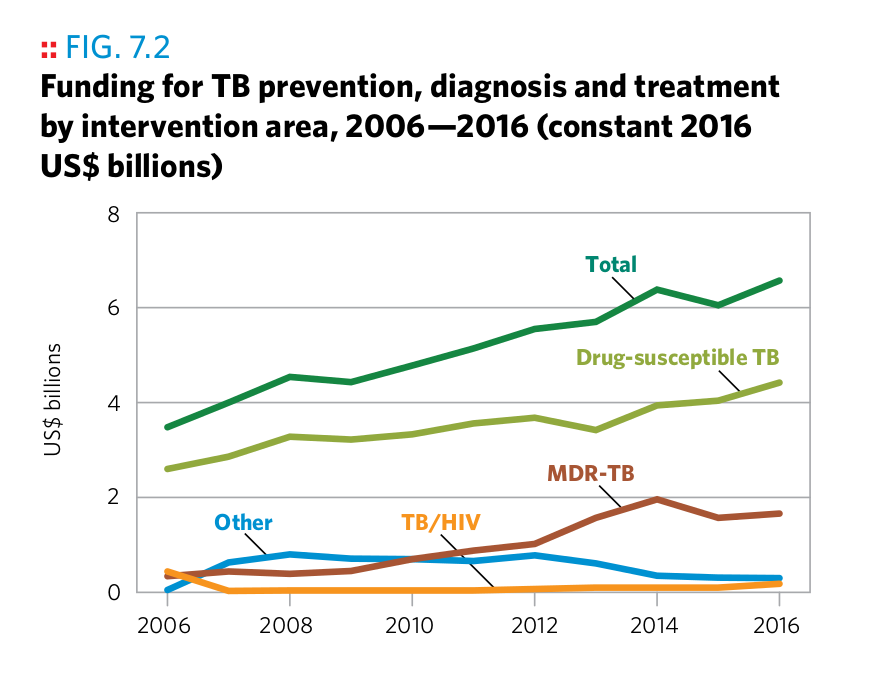
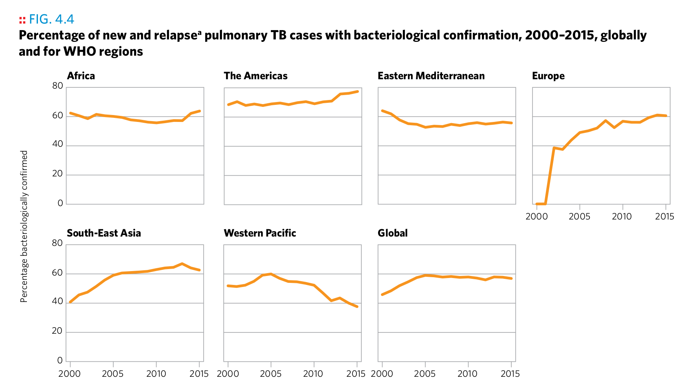
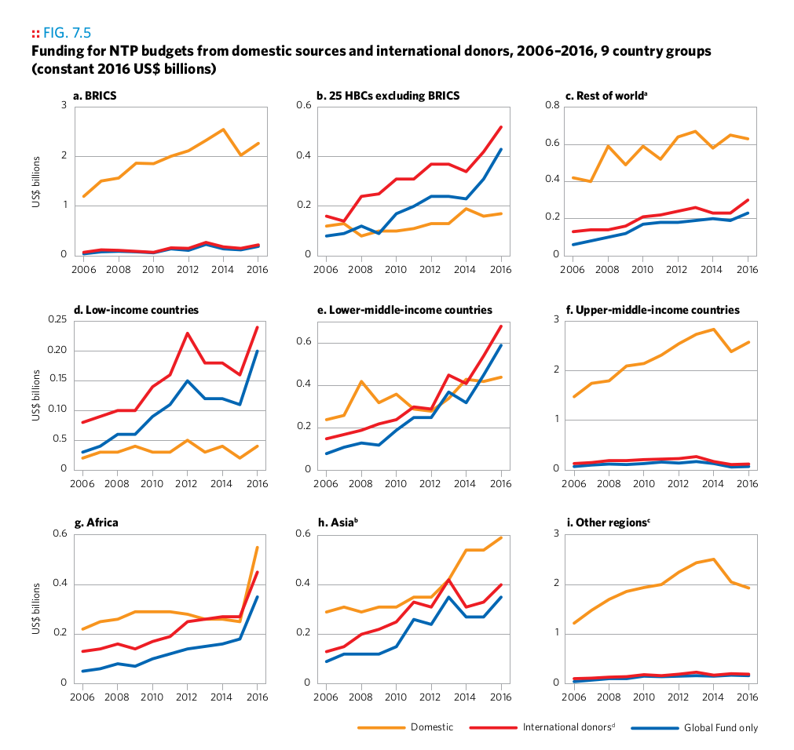

```{r setup, include=FALSE}
knitr::opts_chunk$set(echo = FALSE)
library(tidyverse)
```

## Reverse-engineering, theory

How could the authors of the [2016 WHO TB report](http://www.who.int/tb/publications/global_report/en/) have created the following plots? Assume that each plot is based on one or several suitably crafted dataset(s) that have been transformed in advance to support this particular plot. Answer the following questions for each plot:

1. What layers (geoms) are used?
1. Which variables are mapped to which aesthetics?
1. Can you identify manual aesthetics (i.e., aesthetics that are unchanged for all observations?)
1. What statistical transformations, if any, have been applied?
1. What positional adjustments, if any, have been applied?
1. If an image contains more than one plot, explain the mechanism.
1. What does each observation in the plotting dataset represent?
1. Do you notice details about the plot which you can't explain yet?


### Plot 1


### Plot 2



### Plot 3


### Plot 4



### Plot 5



### Plot 6



### Plot 7



### Plot 8


### Plot 9



### Plot 10


### Plot 11


### Plot 12


### Plot 13


### Plot 14


### Plot 15


### Plot 16


### Plot 17


### Plot 18


### Plot 19


### Plot 20


### Plot 21


## [Reverse-engineering, practice](reverse.html)

Recreate the following plots by filling in the dots in the corresponding code snippets. Use the `high_impact_stats` dataset from the `gfdata` package. What is the purpose of the predefined `scale_...()` and `theme()` calls?

### Plot 1

```r
library(gfdata)
ggplot(
  data = ...,
  mapping = aes(
    x = ordered(...),
    y = ...
  )
) +
  geom_...() +
  scale_y_continuous(labels = scales::percent, limits = c(0, NA)) +
  theme(axis.text.x = element_text(angle = 90, hjust = 1, vjust = 0.5))
```

```{r echo = FALSE}
library(gfdata)
ggplot(
  data = high_impact_stats,
  mapping = aes(
    x = ordered(year),
    y = tb_treatment_coverage_percent
  )
) +
  geom_boxplot() +
  scale_y_continuous(labels = scales::percent, limits = c(0, NA)) +
  theme(axis.text.x = element_text(angle = 90, hjust = 1, vjust = 0.5))
```


```r
library(gfdata)
ggplot(...) +
  geom_...(
    ...,
    fill = "grey"
  ) +
  geom_line(
    ...,
    color = "green"
  ) +
  facet_wrap(~..., scales = ..., ncol = 3) +
  scale_y_continuous(limits = c(0, NA))
```

```{r echo = FALSE, fig.height=8}
library(gfdata)
ggplot(data = high_impact_stats, aes(x = year)) +
  geom_ribbon(
    mapping = aes(
      ymin = people_living_with_hiv_aids_lower_number,
      ymax = people_living_with_hiv_aids_higher_number
    ),
    fill = "grey"
  ) +
  geom_line(
    mapping = aes(y = people_living_with_hiv_aids_number),
    color = "green"
  ) +
  facet_wrap(~country, scales = "free_y", ncol = 3) +
  scale_y_continuous(limits = c(0, NA))
```
